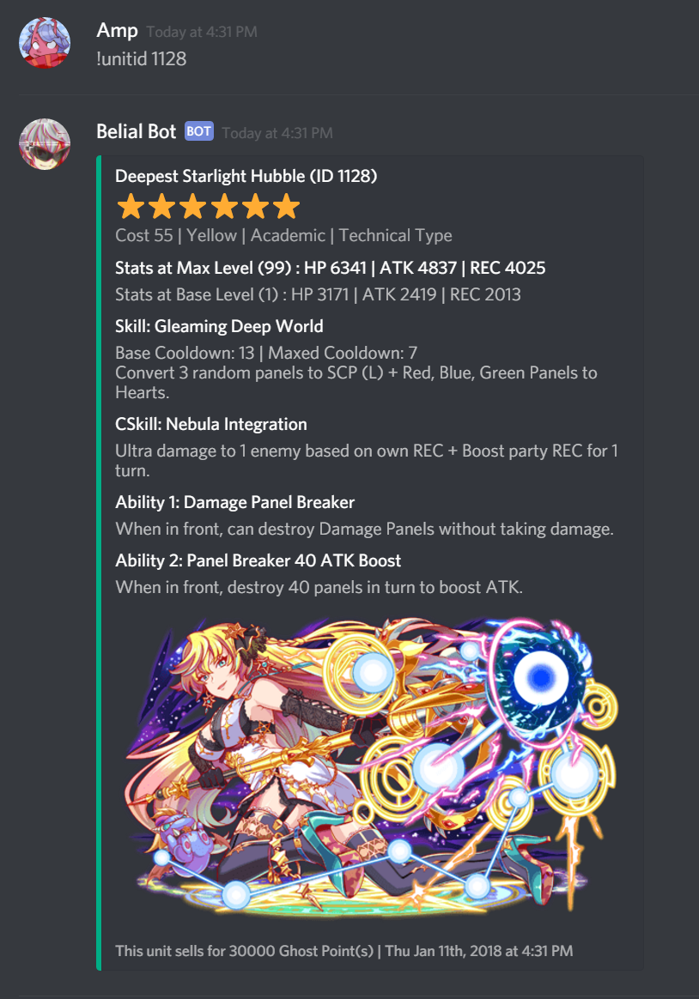
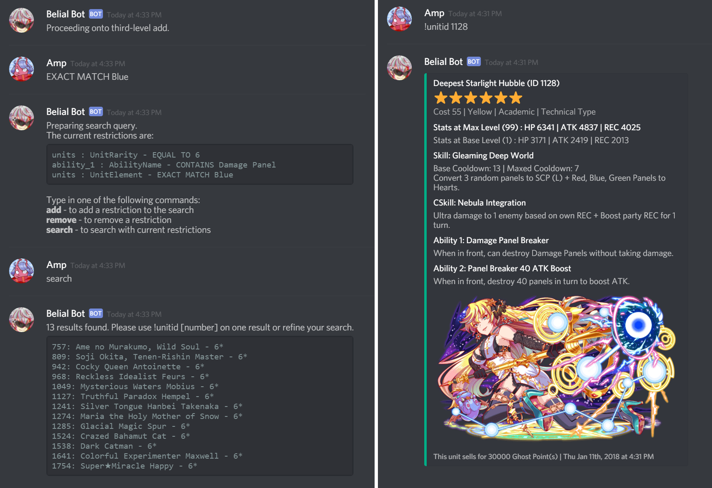

# belial-bot
Node.js Discord bot that helps users make queries to a MySQL database of Crash Fever units. 

## What is this for?
Crash Fever is a popular mobile game for iOS and Android. Check out Crash Fever on the [iOS App Store](https://itunes.apple.com/ca/app/crash-fever/id1146722894) and [Google Play](https://play.google.com/store/apps/details?id=com.wonderplanet.CrashFever)!

This project is a Discord unit lookup bot written in Node.js. It has access to a MySQL database of information on Crash Fever units, such as their rarity, base and max stats, skill descriptions, etc.

Belial Bot is currently a work in progress, and has a few unchecked cases left to cover and features to implement before he will be ready for public use.

## Commands
`!unitid <id>` - Searches for units with ID equal to `id` and brings up an embed of general information about the unit, if available.

`!unitname <name>` - Searches for units with names containing `name` and brings up an embed of general information about the unit, if available.

`!startquery` - Starts an interactive query builder that allows users to traverse the database and set up restrictions to perform a refined search with.

## Dependencies
Belial Bot has dependencies on `discord.js` and `mysql`. It also uses `mysql-promise` to perform Promise-based async calls to the database.

Furthermore, Belial Bot currently scrapes unit information from the unofficial [Crash Fever Wiki](https://cf-wiki.info/). It is stored in a database with structure shown in `dbReference.json`, which is accessed with credentials that should be in a file `auth.json`. A template file `authtemplate.json` is provided.

## Screenshots

